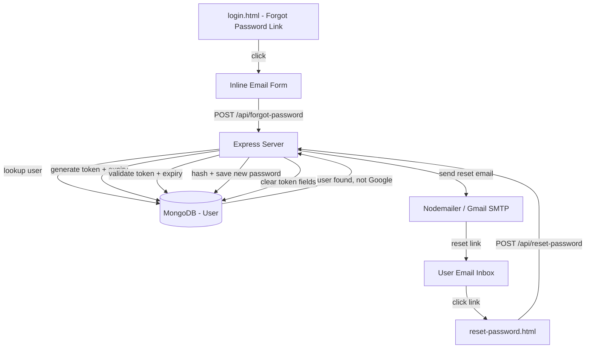
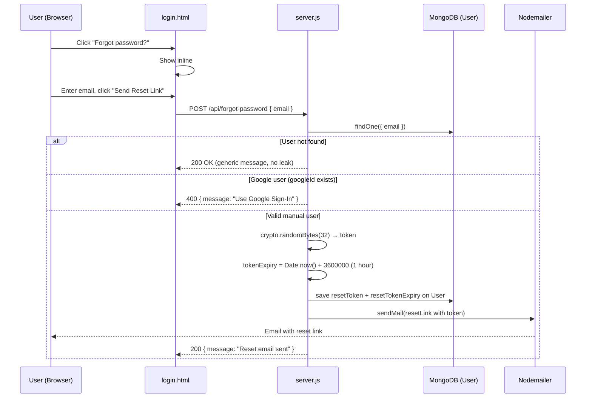
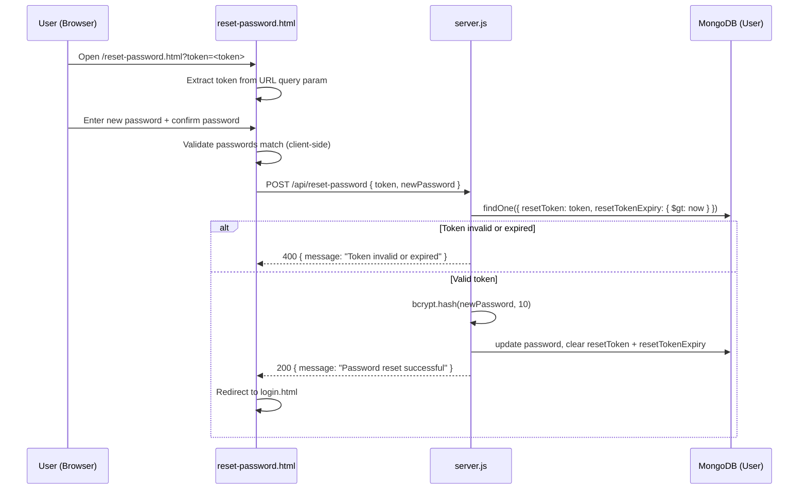

# Design Document: Forgot Password

## Overview

This feature adds a secure, token-based password reset flow to the Finance AI app. When a user clicks "Forgot password?" on the login page, an inline section appears (no page redirect) where they enter their email. The backend generates a time-limited reset token, stores it on the User document, and emails a reset link. Clicking the link opens a new `reset-password.html` page where the user sets a new password. Google OAuth users are blocked from this flow since they have no local password.

The design integrates with the existing stack: Vanilla HTML/CSS/JS frontend, Node.js + Express backend, MongoDB/Mongoose User model, and the already-configured Nodemailer Gmail SMTP transporter.

## Architecture



## Sequence Diagrams

### Flow 1: Request Password Reset



### Flow 2: Reset Password



## Components and Interfaces

### Component 1: Inline Forgot Password Section (login.html)

**Purpose**: Renders an inline collapsible section below the login form when "Forgot password?" is clicked. No page navigation occurs.

**Interface** (DOM elements):
```javascript
// Triggered by clicking .forgot anchor
function showForgotSection()   // reveals #forgot-section, hides #loginForm
function hideForgotSection()   // restores login form view

// Form submission
async function submitForgotPassword(email: string): Promise<void>
// POST /api/forgot-password → show success/error message inline
```

**Responsibilities**:
- Toggle visibility of `#forgot-section` div
- Collect email input and call backend
- Display success/error feedback inline (no alert/redirect)
- Provide a "Back to login" link

### Component 2: Reset Password Page (reset-password.html)

**Purpose**: Standalone page linked from the reset email. Reads the token from the URL, collects new password, and submits to the backend.

**Interface**:
```javascript
function getTokenFromURL(): string          // reads ?token= query param
async function submitResetPassword(         // POST /api/reset-password
    token: string,
    newPassword: string
): Promise<void>
function validatePasswordMatch(             // client-side guard
    password: string,
    confirm: string
): boolean
```

**Responsibilities**:
- Extract token from URL on page load; show error if missing
- Validate new password and confirm password match before submit
- Show success message and redirect to `login.html` on success
- Show clear error message if token is expired or invalid

### Component 3: Backend — `/api/forgot-password` (server.js)

**Purpose**: Generates a secure reset token, persists it to the User document, and dispatches the reset email.

**Interface**:
```javascript
POST /api/forgot-password
Request:  { email: string }
Response: { message: string }   // always 200 to avoid email enumeration
```

**Responsibilities**:
- Look up user by email
- Return generic success if user not found (prevent email enumeration)
- Return 400 if user is a Google OAuth user (`googleId` field is set)
- Generate a cryptographically secure token via `crypto.randomBytes(32)`
- Set `resetToken` and `resetTokenExpiry` (now + 1 hour) on User document
- Send email via existing Nodemailer transporter with the reset link
- Return generic success message

### Component 4: Backend — `/api/reset-password` (server.js)

**Purpose**: Validates the token, hashes the new password, and updates the User document.

**Interface**:
```javascript
POST /api/reset-password
Request:  { token: string, newPassword: string }
Response: { message: string } | { error: string }
```

**Responsibilities**:
- Find user where `resetToken === token` AND `resetTokenExpiry > Date.now()`
- Return 400 if no matching user found (invalid or expired token)
- Hash new password with `bcrypt.hash(newPassword, 10)`
- Save new password hash, clear `resetToken` and `resetTokenExpiry` fields
- Return 200 success

## Data Models

### Updated User Model (models/user.js)

```javascript
const UserSchema = new mongoose.Schema({
    email:              { type: String, required: true, unique: true },
    password:           { type: String },                    // manual users only
    googleId:           { type: String },                    // Google OAuth users
    authProvider:       { type: String, default: 'manual' }, // 'google' | 'manual'
    resetToken:         { type: String, default: null },     // hex token string
    resetTokenExpiry:   { type: Date,   default: null }      // expiry timestamp
});
```

**Validation Rules**:
- `resetToken` is only set during an active reset request; cleared after use or expiry
- `resetTokenExpiry` must be a future date when a reset is in progress
- Google users (`googleId` is set) must never have `resetToken` written to them

## Key Functions with Formal Specifications

### `POST /api/forgot-password` handler

**Preconditions**:
- `req.body.email` is a non-empty string
- MongoDB connection is active
- Nodemailer transporter is configured

**Postconditions**:
- If user not found: response is `200 { message: "If that email exists, a reset link has been sent." }` — no DB mutation
- If Google user: response is `400 { message: "This account uses Google Sign-In. Please sign in with Google." }` — no DB mutation
- If valid manual user: `user.resetToken` is a 64-char hex string, `user.resetTokenExpiry` is `Date.now() + 3600000`, reset email is dispatched, response is `200`
- Response HTTP status is never 404 (prevents email enumeration)

**Loop Invariants**: N/A (no loops)

### `POST /api/reset-password` handler

**Preconditions**:
- `req.body.token` is a non-empty string
- `req.body.newPassword` is a non-empty string (min 6 chars enforced client-side)
- MongoDB connection is active

**Postconditions**:
- If no user found with matching token and non-expired expiry: response is `400 { message: "Reset link is invalid or has expired." }` — no DB mutation
- If valid: `user.password` is updated to `bcrypt.hash(newPassword, 10)`, `user.resetToken` is `null`, `user.resetTokenExpiry` is `null`, response is `200 { message: "Password reset successful." }`
- Token is single-use: cleared immediately after successful reset

**Loop Invariants**: N/A (no loops)

## Algorithmic Pseudocode

### Forgot Password Algorithm

```pascal
PROCEDURE handleForgotPassword(req, res)
  INPUT: req.body.email (string)
  OUTPUT: HTTP response

  SEQUENCE
    email ← req.body.email

    IF email IS empty THEN
      RETURN res.status(400).json({ message: "Email is required" })
    END IF

    user ← await User.findOne({ email })

    IF user IS NULL THEN
      // Do not reveal whether email exists
      RETURN res.status(200).json({ message: "If that email exists, a reset link has been sent." })
    END IF

    IF user.googleId IS NOT NULL THEN
      RETURN res.status(400).json({ message: "This account uses Google Sign-In." })
    END IF

    token ← crypto.randomBytes(32).toString('hex')
    expiry ← new Date(Date.now() + 3600000)  // 1 hour from now

    user.resetToken ← token
    user.resetTokenExpiry ← expiry
    await user.save()

    resetURL ← BASE_URL + "/reset-password.html?token=" + token

    await transporter.sendMail({
      to: email,
      subject: "Reset your Finance AI password",
      html: resetEmailTemplate(resetURL)
    })

    RETURN res.status(200).json({ message: "If that email exists, a reset link has been sent." })
  END SEQUENCE
END PROCEDURE
```

### Reset Password Algorithm

```pascal
PROCEDURE handleResetPassword(req, res)
  INPUT: req.body.token (string), req.body.newPassword (string)
  OUTPUT: HTTP response

  SEQUENCE
    token ← req.body.token
    newPassword ← req.body.newPassword

    IF token IS empty OR newPassword IS empty THEN
      RETURN res.status(400).json({ message: "Token and new password are required." })
    END IF

    now ← new Date()
    user ← await User.findOne({
      resetToken: token,
      resetTokenExpiry: { $gt: now }
    })

    IF user IS NULL THEN
      RETURN res.status(400).json({ message: "Reset link is invalid or has expired." })
    END IF

    hashedPassword ← await bcrypt.hash(newPassword, 10)

    user.password ← hashedPassword
    user.resetToken ← null
    user.resetTokenExpiry ← null
    await user.save()

    RETURN res.status(200).json({ message: "Password reset successful." })
  END SEQUENCE
END PROCEDURE
```

### Client-Side: Show Forgot Section

```pascal
PROCEDURE showForgotSection()
  SEQUENCE
    loginForm ← document.getElementById('loginForm')
    forgotSection ← document.getElementById('forgot-section')

    loginForm.style.display ← 'none'
    forgotSection.style.display ← 'block'

    document.getElementById('forgot-email').focus()
  END SEQUENCE
END PROCEDURE

PROCEDURE submitForgotPassword(event)
  INPUT: form submit event
  SEQUENCE
    event.preventDefault()
    email ← document.getElementById('forgot-email').value
    btn ← document.getElementById('forgot-btn')

    btn.disabled ← true
    btn.textContent ← 'Sending...'

    response ← await fetch(BASE_URL + '/api/forgot-password', {
      method: 'POST',
      headers: { 'Content-Type': 'application/json' },
      body: JSON.stringify({ email })
    })
    data ← await response.json()

    IF response.ok THEN
      showForgotSuccess("Check your inbox for a reset link.")
    ELSE
      showForgotError(data.message)
    END IF

    btn.disabled ← false
    btn.textContent ← 'Send Reset Link'
  END SEQUENCE
END PROCEDURE
```

### Client-Side: Reset Password Page

```pascal
PROCEDURE onResetPageLoad()
  SEQUENCE
    params ← new URLSearchParams(window.location.search)
    token ← params.get('token')

    IF token IS NULL OR token IS empty THEN
      showError("Invalid reset link. Please request a new one.")
      hideResetForm()
      RETURN
    END IF

    Store token in hidden input or module-level variable
  END SEQUENCE
END PROCEDURE

PROCEDURE submitNewPassword(event)
  INPUT: form submit event
  SEQUENCE
    event.preventDefault()
    newPassword ← document.getElementById('new-password').value
    confirmPassword ← document.getElementById('confirm-password').value

    IF newPassword !== confirmPassword THEN
      showError("Passwords do not match.")
      RETURN
    END IF

    IF newPassword.length < 6 THEN
      showError("Password must be at least 6 characters.")
      RETURN
    END IF

    response ← await fetch(BASE_URL + '/api/reset-password', {
      method: 'POST',
      headers: { 'Content-Type': 'application/json' },
      body: JSON.stringify({ token, newPassword })
    })
    data ← await response.json()

    IF response.ok THEN
      showSuccess("Password reset! Redirecting to login...")
      setTimeout(() => window.location.href = 'login.html', 2000)
    ELSE
      showError(data.message)
    END IF
  END SEQUENCE
END PROCEDURE
```

## Example Usage

```javascript
// 1. User clicks "Forgot password?" on login.html
document.querySelector('.forgot').addEventListener('click', (e) => {
    e.preventDefault();
    showForgotSection();
});

// 2. Backend generates and stores token
const token = crypto.randomBytes(32).toString('hex');
user.resetToken = token;
user.resetTokenExpiry = new Date(Date.now() + 3600 * 1000); // 1 hour
await user.save();

// 3. Reset link in email
const resetURL = `${process.env.FRONTEND_URL}/reset-password.html?token=${token}`;

// 4. reset-password.html reads token on load
const token = new URLSearchParams(window.location.search).get('token');

// 5. Backend validates and clears token
const user = await User.findOne({
    resetToken: token,
    resetTokenExpiry: { $gt: new Date() }
});
if (!user) return res.status(400).json({ message: "Reset link is invalid or has expired." });
user.password = await bcrypt.hash(newPassword, 10);
user.resetToken = null;
user.resetTokenExpiry = null;
await user.save();
```

## Correctness Properties

*A property is a characteristic or behavior that should hold true across all valid executions of a system — essentially, a formal statement about what the system should do. Properties serve as the bridge between human-readable specifications and machine-verifiable correctness guarantees.*

### Property 1: Email Enumeration Prevention

*For any* email string that does not correspond to a registered User document, a POST to `/api/forgot-password` shall always return HTTP 200 with the generic message, and no database mutation shall occur.

**Validates: Requirements 3.1, 3.2**

---

### Property 2: Google User Guard — No Token Written

*For any* User document where `googleId` is set, a POST to `/api/forgot-password` with that user's email shall return HTTP 400, and `user.resetToken` and `user.resetTokenExpiry` shall remain `null` after the call.

**Validates: Requirements 4.1, 4.2, 11.4**

---

### Property 3: Reset Token Format

*For any* valid Manual_User, the Reset_Token generated by the forgot-password handler shall be a 64-character lowercase hexadecimal string (the output of `crypto.randomBytes(32).toString('hex')`).

**Validates: Requirements 5.1**

---

### Property 4: Token Expiry Is One Hour in the Future

*For any* valid Manual_User, after a successful forgot-password request, `user.resetTokenExpiry` shall be a Date value approximately equal to `Date.now() + 3600000` (within a small tolerance for execution time).

**Validates: Requirements 5.2**

---

### Property 5: Reset Email Contains Correct Token URL

*For any* valid Manual_User, the email dispatched by Nodemailer shall contain a reset link whose `token` query parameter matches the `resetToken` saved to the User document.

**Validates: Requirements 5.3**

---

### Property 6: Email Send Failure Prevents Database Mutation

*For any* valid Manual_User, if Nodemailer throws an error during `sendMail`, the Server shall return HTTP 500 and `user.resetToken` and `user.resetTokenExpiry` shall not be persisted to the database.

**Validates: Requirements 5.4**

---

### Property 7: Invalid or Expired Token Returns 400

*For any* token string that either does not match any User document's `resetToken` field, or whose corresponding `resetTokenExpiry` is less than or equal to the current time, a POST to `/api/reset-password` shall return HTTP 400 and perform no database mutation.

**Validates: Requirements 8.1, 8.2**

---

### Property 8: Successful Reset Stores Bcrypt Hash

*For any* valid new password string submitted with a valid non-expired token, the value stored in `user.password` after a successful reset shall be a valid bcrypt hash that satisfies `bcrypt.compare(newPassword, user.password) === true`.

**Validates: Requirements 9.1**

---

### Property 9: Single-Use Token — Cleared After Reset

*For any* successful password reset, after the operation completes, `user.resetToken` shall be `null` and `user.resetTokenExpiry` shall be `null`, causing any subsequent POST to `/api/reset-password` with the same token to return HTTP 400.

**Validates: Requirements 9.2, 9.4, 11.3**

---

### Property 10: Password Mismatch Validation

*For any* two strings where `newPassword !== confirmPassword`, the client-side `validatePasswordMatch` function shall return `false` and the reset form shall not be submitted to the Server.

**Validates: Requirements 7.1**

---

### Property 11: Short Password Validation

*For any* string with `length < 6`, the client-side password validation on the Reset_Page shall reject the input and not submit the form to the Server.

**Validates: Requirements 7.2**

---

### Property 12: Token Extraction from URL

*For any* URL string containing a `token` query parameter, the `getTokenFromURL` function shall return the exact token value from the URL; for any URL without a `token` parameter, it shall return `null` or an empty string.

**Validates: Requirements 6.1, 6.2**

## Error Handling

### Error Scenario 1: Email Not Found

**Condition**: `POST /api/forgot-password` called with an email that has no User document
**Response**: `200 { message: "If that email exists, a reset link has been sent." }`
**Recovery**: No action needed; generic message prevents email enumeration

### Error Scenario 2: Google OAuth User Attempts Reset

**Condition**: User document has `googleId` set
**Response**: `400 { message: "This account uses Google Sign-In. Please sign in with Google." }`
**Recovery**: Frontend displays the message inline; user is guided to use Google login

### Error Scenario 3: Expired Reset Token

**Condition**: `POST /api/reset-password` called with a token where `resetTokenExpiry <= Date.now()`
**Response**: `400 { message: "Reset link is invalid or has expired." }`
**Recovery**: User is shown a link to request a new reset email

### Error Scenario 4: Invalid / Tampered Token

**Condition**: Token string does not match any User document
**Response**: `400 { message: "Reset link is invalid or has expired." }`
**Recovery**: Same as expired token — user requests a new link

### Error Scenario 5: Email Send Failure

**Condition**: Nodemailer `sendMail` throws (SMTP error, quota exceeded, etc.)
**Response**: `500 { message: "Failed to send reset email. Please try again." }`
**Recovery**: Token is NOT saved to DB if email fails (save after successful send, or roll back on failure)

### Error Scenario 6: Passwords Don't Match (Client-Side)

**Condition**: `newPassword !== confirmPassword` on `reset-password.html`
**Response**: Inline error message shown; form not submitted
**Recovery**: User corrects input

## Testing Strategy

### Unit Testing Approach

- Test `POST /api/forgot-password` with: valid manual user, non-existent email, Google user
- Test `POST /api/reset-password` with: valid token, expired token, invalid token, already-used token
- Test User model: verify `resetToken` and `resetTokenExpiry` fields save and clear correctly
- Test `validatePasswordMatch()` with matching and non-matching passwords

### Property-Based Testing Approach

**Property Test Library**: fast-check

- For any random email string not in the DB, `POST /api/forgot-password` always returns 200 (no enumeration leak)
- For any token string not matching a valid, non-expired DB entry, `POST /api/reset-password` always returns 400
- For any successful reset, querying the user afterwards always shows `resetToken === null`

### Integration Testing Approach

- End-to-end: trigger forgot-password → capture token from DB → call reset-password → verify login works with new password
- Verify old password no longer works after reset
- Verify token cannot be reused after a successful reset

## Security Considerations

- **Email enumeration prevention**: The forgot-password endpoint always returns 200 with a generic message, regardless of whether the email exists
- **Token entropy**: `crypto.randomBytes(32)` produces 256 bits of entropy — brute-force infeasible
- **Token expiry**: 1-hour TTL limits the window of exposure if an email is intercepted
- **Single-use tokens**: Token fields are nulled out immediately after a successful reset
- **Google OAuth guard**: Users with `googleId` are explicitly blocked; they have no local password to reset
- **bcrypt hashing**: New passwords are hashed with cost factor 10, consistent with existing auth flow
- **HTTPS assumption**: Reset links should only be sent when the app is served over HTTPS in production

## Dependencies

- `crypto` — Node.js built-in; used for `randomBytes(32)` token generation (no new install needed)
- `bcryptjs` — already installed; used for hashing new password
- `nodemailer` — already installed and configured in `server.js`
- `mongoose` — already installed; User model extended with two new fields
- No new npm packages required
